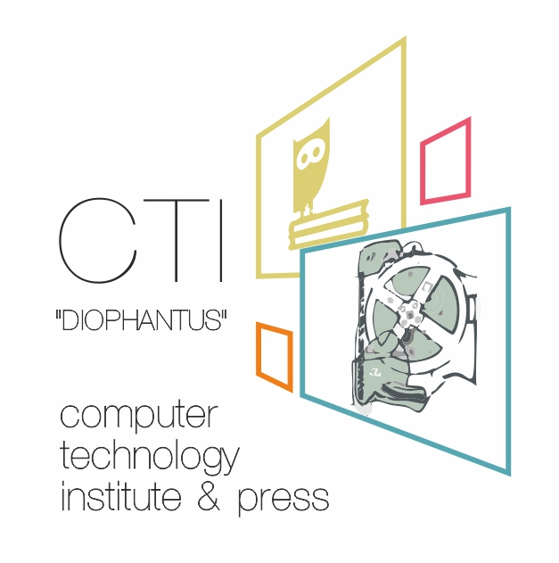

# SAINT - Open Source Tool for the Monitoring of Cybersecurity threats activity

    

Useful information:
* [SAINT project home page](https://project-saint.eu/)
* [SAINT EU page](https://cordis.europa.eu/project/id/740829)
* Programme(s): H2020-EU.3.7.4. - Improve cyber security 
* Topic(s): DS-04-2016 - Economics of Cybersecurity 
* Project duration: 1 May 2017 - 30 April 2019
* Call for proposal: H2020-DS-SC7-2016
* Funding Scheme: RIA - Research and Innovation action

This repository contains the coding work that was developed as a part of the SAINT project and 
constitutes the main IT development core of the SAINT project where CTI was the lead partner of this task.

## Project Objectives

SAINT proposes to analyse and identify incentives to improve levels of collaboration between cooperative 
and regulatory approaches to information sharing. Analysis of the ecosystems of cybercriminal activity, 
associated markets and revenues will drive the development of a framework of business models appropriate 
for the fighting of cybercrime.  The role of regulatory approaches as a cost benefit in cybercrime 
reduction will be explored within a concept of greater collaboration in order to gain optimal attrition 
of cybercriminal activities. Experimental economics will aid SAINT in designing new methodologies for 
the development of an ongoing and searchable public database of cybersecurity indicators and open source 
intelligence. Comparative analysis of cybercrime victims and stakeholders within a framework of 
qualitative social science methodologies will deliver valuable evidences and advance knowledge on 
privacy issues and Deep Web practices. Equally, comparative analysis of the failures of current 
cybersecurity solutions, products and models will underpin a model for greater effectiveness of 
applications and improved cost-benefits within the information security industry. SAINT proposes to 
advance measurement approaches and methodologies of the metrics of cybercrime through the construct 
of a framework of a new empirical science that challenges traditional approaches and fuses evidence-based 
practices with more established disciplines for a lasting legacy. SAINT’s innovative models, algorithms 
and automated framework for objective metrics will benefit decision-makers, regulators, law enforcement 
in the EU, at national and organisational levels providing improved cost-benefit analysis and supported 
by tangible and intangible costs for optimal risk and investment incentives. The resulting ongoing 
business spin off and the potential for novel research and further studies will be attractive to 
academia and researchers beyond the lifetime of the project.

    

    

